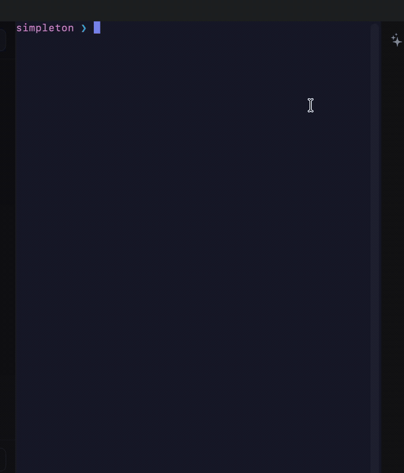

<div align="center">

# ⚡ Simpleton

### A fast, native macOS terminal — tabs, splits, SSH, and an AI copilot, built in Swift.

[](https://github.com/bbjansen/simpleton/actions/workflows/ci.yml)
[](https://github.com/bbjansen/simpleton/releases)
[](https://www.apple.com/macos/)
[](https://swift.org)
[](LICENSE)
[](#-project-status)

<br/>



</div>

---

Simpleton is a from-scratch, native **AppKit + SwiftUI** terminal for macOS. It pairs a
GPU-friendly [SwiftTerm](https://github.com/migueldeicaza/SwiftTerm) core with native window
tabbing, recursive split panes, first-class SSH, and an optional AI copilot — with none of the
Electron weight.

> **⚠️ Alpha software.** Simpleton is under active development at version `0.1.1`. Expect rough
> edges and breaking changes. See [Project status](#-project-status) before you rely on it.

## ✨ Features

| | |
|---|---|
| 🖥️ **Native terminal** | SwiftTerm-backed emulator with true-color, mouse reporting, and a configurable scrollback buffer. |
| 🗂️ **Tabs & splits** | Native macOS window tabbing plus arbitrarily **nested** split panes (split right / split down, focus by direction, zoom a pane). |
| 🔐 **SSH built in** | Connection bookmarks with frecency ranking, one-click `~/.ssh/config` import, keepalive, and auto-reconnect. |
| 🧭 **Connection sidebar** | Pinned + recent connections, live search, and SSH-config hosts — one click to connect in the active tab. |
| 🤖 **AI copilot** | Optional per-tab AI chat, skills, and MCP tool support, with a command classifier that gates destructive shell actions. |
| 🧩 **Panels** | Dockable side panels: command history, environment, processes, Docker, notes, SSH tunnels, and more. |
| 🎨 **Themes & plugins** | Theme discovery, a plugin manager with lifecycle events, and user scripts. |
| ⚙️ **Deep preferences** | General, Appearance, Terminal, SSH, Keys, Plugins, AI, Skills, and Profiles — in a resizable window. |
| 🔄 **Auto-update** | [Sparkle](https://sparkle-project.org)-based update channel (disabled in dev builds). |

## 🚀 Getting started

### Requirements

- **macOS 14 (Sonoma)** or later
- **Swift 5.9+** / Xcode 15+ (to build from source)

### Install a release

1. Download the latest `Simpleton-*.zip` from the [Releases page](https://github.com/bbjansen/simpleton/releases).
2. Unzip and drag `Simpleton.app` to `/Applications`.
3. Alpha builds are **ad-hoc signed** (not notarized), so the first launch needs a nudge past Gatekeeper:

   ```bash
   xattr -dr com.apple.quarantine /Applications/Simpleton.app
   ```

   …or right-click the app → **Open** → **Open**.

### Build from source

```bash
git clone https://github.com/bbjansen/simpleton.git
cd simpleton

# Build and run the app directly
swift run Simpleton

# …or produce a launchable, self-contained .app bundle
bash scripts/e2e/make-app-bundle.sh release
open .build/Simpleton.app
```

> **Dev signing (optional).** Running the bundle repeatedly can trigger Keychain prompts because the
> code signature changes each build. Create a stable local identity once and sign after each build:
>
> ```bash
> bash scripts/dev/make-dev-cert.sh   # one time: creates a "Simpleton Dev" self-signed identity
> swift build && bash scripts/dev/sign-dev.sh
> ```

## 🧪 Testing

Simpleton ships a dependency-free test runner (`CoreChecks`) so the core logic can be verified
**without Xcode or a GUI** — ideal for CI:

```bash
swift run CoreChecks
```

It exercises config, session state, split-tree, SSH-config parsing, bookmarks, frecency, fuzzy
matching, the command classifier, and more (250+ checks). CI runs it on every push and pull request.

## 🏗️ Architecture

Simpleton is a Swift Package with a clean split between reusable logic and the AppKit shell:

```
Sources/
├── SimpletonCore/     # Pure, testable logic — models, stores, parsers (no AppKit)
└── Simpleton/         # AppKit + SwiftUI app — windows, panes, panels, AI, preferences
Tests/
└── CoreChecks/        # No-Xcode test runner over SimpletonCore
scripts/
├── dev/               # Local dev-signing helpers
└── e2e/               # App-bundle assembly + accessibility-driven UI smoke tests
```

Keeping the domain logic in `SimpletonCore` (free of UI frameworks) is what makes the headless
`CoreChecks` runner — and fast CI — possible.

## ⚙️ Configuration

Settings live at `~/Library/Application Support/Simpleton/config.json` and are editable from the
in-app **Preferences** window (`⌘,`). Connection bookmarks, themes, and plugins live alongside it.

## 🗺️ Roadmap

- [ ] Re-enable session restore behind a non-blocking prompt
- [ ] Custom, user-editable key bindings
- [ ] Notarized, signed release builds
- [ ] Profiles per connection (theme, shell, environment)
- [ ] Richer AI tool/skill catalog

## 🧭 Project status

Simpleton is **alpha**. The core terminal, tabs, splits, SSH, panels, and preferences are usable
day-to-day, but APIs, config schema, and UI are still moving. Session restore is temporarily
disabled while it is reworked. Feedback and issues are very welcome.

## 🤝 Contributing

Contributions are welcome! Please read **[CONTRIBUTING.md](CONTRIBUTING.md)** for the dev setup,
branch/commit conventions, and how to run the checks before opening a pull request.

## 📄 License

Released under the [MIT License](LICENSE).

## 🙏 Acknowledgements

- [SwiftTerm](https://github.com/migueldeicaza/SwiftTerm) — the terminal emulation core
- [Sparkle](https://sparkle-project.org) — macOS software updates
